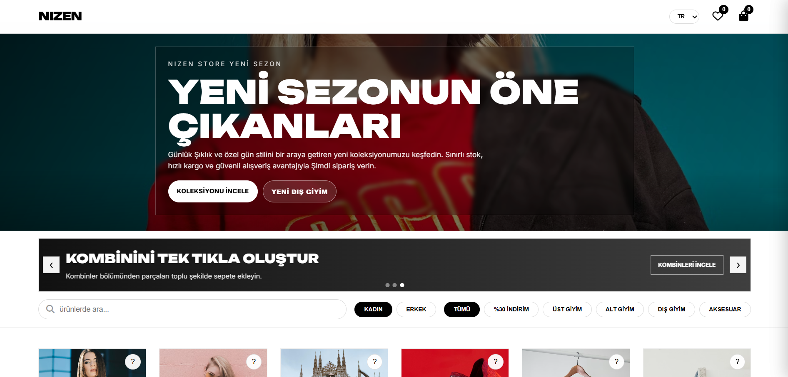

<div align="center">

# 🛍️ NizenStore

### Modern E-Commerce Website • Clean UI • Responsive Design

[](https://berfinida.github.io/NizenStore/)
[]()
[]()
[]()
[]()

A modern **e-commerce web application interface** built with **HTML, CSS and JavaScript**.

🌐 **Live Demo**  
https://berfinida.github.io/NizenStore/

</div>

---

# ✨ Overview

**NizenStore** is a modern online store interface designed to simulate a **real e-commerce shopping experience**.

The application focuses on providing a **clean, minimal and user-friendly shopping interface**.

The system includes:

• product catalog  
• product detail views  
• cart system  
• responsive layout  

The goal is to demonstrate a **modern frontend architecture for online store websites**.

---

# 🚀 Features

## 🛍 Product Catalog

Products are displayed in a clean and organized layout.

Each product includes:

• product image  
• name  
• description  
• price  

---

## 🔎 Product Browsing

Users can easily explore products through a structured product list.

Features include:

• modern grid layout  
• intuitive navigation  
• clean product cards  

---

## 🛒 Shopping Cart System

Customers can add items to a shopping cart.

Features include:

• add to cart  
• remove items  
• update quantity  
• order preview  

---

## 📱 Responsive Design

The interface adapts smoothly across devices.

Supported screens:

• mobile  
• tablet  
• desktop  

---

# 🖼 Interface Preview


---

# 🛠 Tech Stack

| Technology | Purpose |
|------------|--------|
| HTML5 | Page structure |
| CSS3 | UI design |
| JavaScript | Interactive logic |

The project is built **without frameworks** to keep the application lightweight and fast.

---

# 📂 Project Structure

```
NizenStore
│
├── assets/
├── images/
│
├── index.html
├── style.css
├── script.js
├── README.md
└── preview.png
```

---

# 🎯 Project Purpose

The project was created to:

• practice modern frontend development  
• build a realistic e-commerce UI  
• create a portfolio-ready web application  

---

# 🔮 Future Improvements

Possible improvements for the project:

• payment system integration  
• user authentication system  
• product filtering and search  
• admin dashboard  
• backend integration (Node.js / Python)

---

# 👩‍💻 Developer

**Berfin Nida Öztürk**

GitHub  
https://github.com/berfinida

LinkedIn  
https://www.linkedin.com/in/berfin-nida-%C3%B6zt%C3%BCrk-6a12131b7/

---

# 📄 License

MIT License
